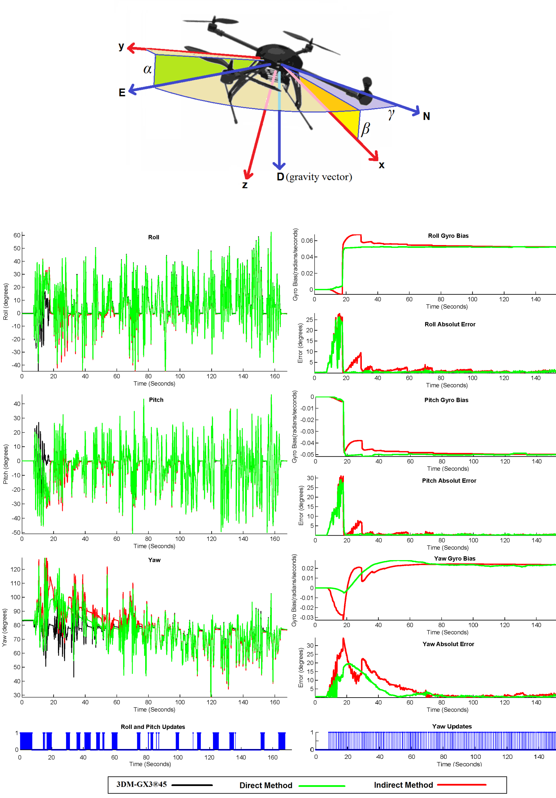

# AHRS: A practical method for implementing an attitude and heading reference system

  

MATLAB implementation code for paper: 

*A practical method for implementing an attitude and heading reference system
R Munguía, A Grau,
International Journal of Advanced Robotic Systems 11 (4), 62, 2014*

**Instructions:**
- Run script AHRSv2.m

